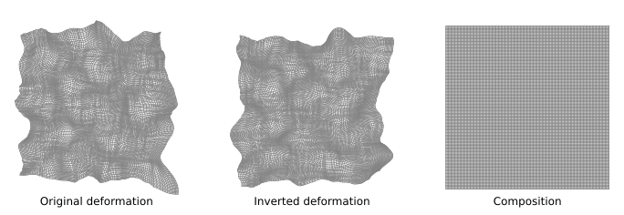

# Deformation inversion layer

*Deformation inversion layer* is a neural network layer for inverting deformation fields develped as part of SITReg, a deep learning intra-modality image registration arhitecture fulfilling strict symmetry properties.

## Installation

Install using pip by running the command

    pip install deformation-inversion-layer

## Requirements

- `Python 3.8+`
- `PyTorch 1.10+`

## Documentation

For a quick start tutorial, see [quick_start.ipynb](tutorials/quick_start.ipynb). For API reference, go to [https://honkamj.github.io/deformation-inversion-layer/](https://honkamj.github.io/deformation-inversion-layer/).

## SITReg

For SITReg implementation, see repository [SITReg](https://github.com/honkamj/SITReg).

## Publication

If you use deformation inversion layer, or other parts of the repository, please cite (see [bibtex](citations.bib)):

- **SITReg: Multi-resolution architecture for symmetric, inverse consistent, and topology preserving image registration**  
[Joel Honkamaa](https://github.com/honkamj "Joel Honkamaa"), Pekka Marttinen  
The Journal of Machine Learning for Biomedical Imaging (MELBA) ([10.59275/j.melba.2024-276b](https://doi.org/10.59275/j.melba.2024-276b "10.59275/j.melba.2024-276b"))

## Acknowledgments

[Tutorial](http://implicit-layers-tutorial.org/) by Zico Kolter, David Duvenaud, and Matt Johnson was very helpful in implementing the layer.

## License

Deformation inversion layer and SITReg are released under the MIT license.